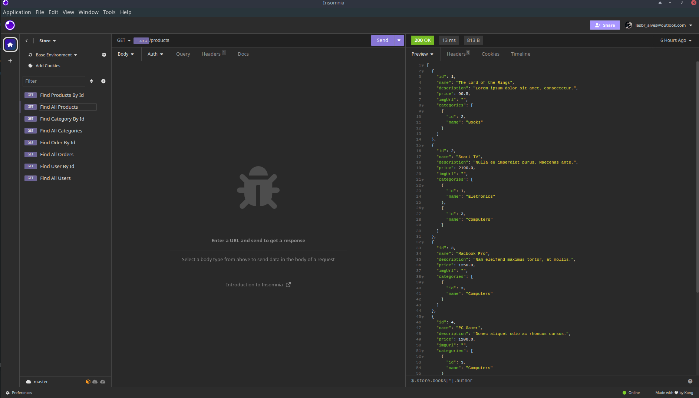
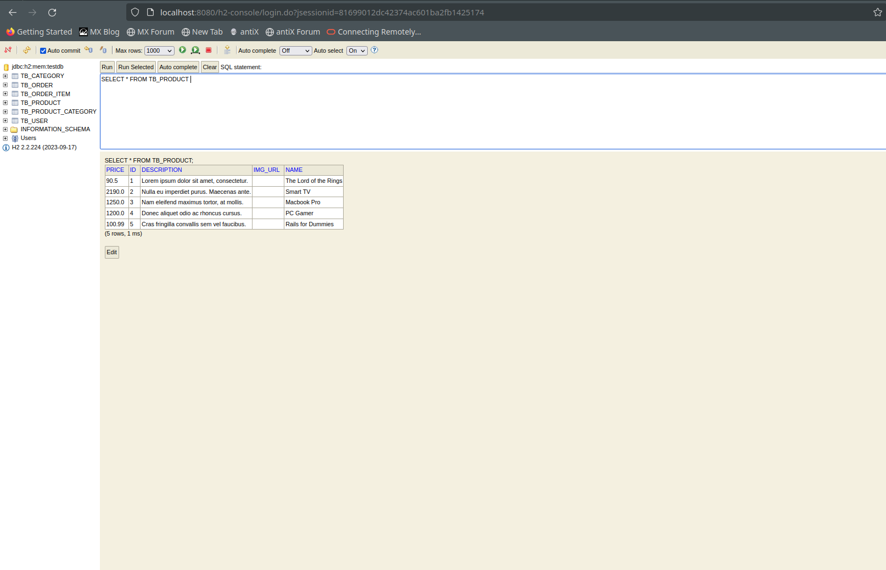

# Loja Virtual

Esta é uma aplicação Spring Boot (API REST) para operações em uma loja virtual. Atualmente em desenvolvimento, a aplicação é escrita em Java e, no futuro, será utilizada uma base de dados relacional mais robusta, possivelmente com Docker e métricas de DevOps na fase de implementação.

## Tecnologias Utilizadas

- Java
- Spring Boot
- H2 Database (para testes)
- Maven

## Principais Classes

### `User` 
A classe `User` representa um usuário da loja virtual. Cada usuário possui um identificador único, nome, e-mail, número de telefone, senha e pode ter realizado vários pedidos.

### `Order` 
A classe `Order` representa um pedido feito por um usuário. Cada pedido possui um identificador único, um momento de realização, um status e está associado a um usuário. Além disso, um pedido pode conter vários itens.

### `Category`

A classe `Category` representa uma categoria de produtos na loja virtual. Cada categoria possui um identificador único, um nome e pode estar associada a vários produtos.

### `Product`
A classe `Product` representa um produto disponível na loja virtual. Cada produto possui um identificador único, um nome, descrição, preço, URL da imagem e pode estar associado a uma ou mais categorias.

### `OrderStatus`
A enumeração `OrderStatus` define os possíveis estados de um pedido, como "Aguardando pagamento", "Pago", "Enviado", "Entregue" e "Cancelado".

### `OrderItem`
A classe `OrderItem` representa um item específico em um pedido. Cada item possui uma quantidade, um preço e está associado a um produto e a um pedido.

## Endpoints da API (Até o momento)

- **User**: `/users`
  - `GET /users`: Recuperar todos os usuários cadastrados.
  - `GET /users/{id}`: Recuperar um usuário específico por ID.
  - `POST /users`: Criar um novo usuário.
  - `PUT /users/{id}`: Atualizar um usuário existente por ID.
  - `DELETE /users/{id}`: Excluir um usuário por ID.

- **Order**: `/orders`
  - `GET /orders`: Recuperar todas os pedidos.
  - `GET /orders/{id}`: Recuperar um pedido específica por ID.
  - `POST /orders`: Criar uma novo pedido. (TO-DO)
  - `PUT /orders/{id}`: Atualizar um pedido existente por ID. (TO-DO)
  - `DELETE /orders/{id}`: Excluir um pedido por ID. (TO-DO)

- **Category**: `/categories`
  - `GET /categories`: Recuperar todas as categorias cadastradas.
  - `GET /categories/{Id}`: Recuperar uma categoria específica por ID.
  - `POST /categories`: Adicionar uma nova categoria. (TO-DO)
  - `PUT /categories/{Id}`: Atualizar uma categoria existente por ID. (TO-DO)
  - `DELETE /categories/{Id}`: Excluir uma categoria por ID. (TO-DO)

- **Product**: `/products`
  - `GET /products`: Recuperar todas os produtos cadastrados.
  - `GET /products/{Id}`: Recuperar um produto específica por ID.
  - `POST /products`: Adicionar um novo produto. (TO-DO)
  - `PUT /products/{Id}`: Atualizar um produto existente por ID. (TO-DO)
  - `DELETE /products/{Id}`: Excluir um produto por ID. (TO-DO)	
	
## Testando a Aplicação

Os testes dos endpoints foram realizados com o insomnia, mas pode ser utilizado qualquer outra aplicação de testes de API, como por exemplo, o postman.

* Acessar o endpoint no insomnia: http://localhost:8080

	
* Acessar o endpoint do H2: http://localhost:8080/h2-console

## Aviso

Esta aplicação ainda está em desenvolvimento, e novas atualizações serão disponibilizadas em breve. Fique atento para obter as últimas melhorias e recursos adicionados à medida que continuamos aprimorando a aplicação. 